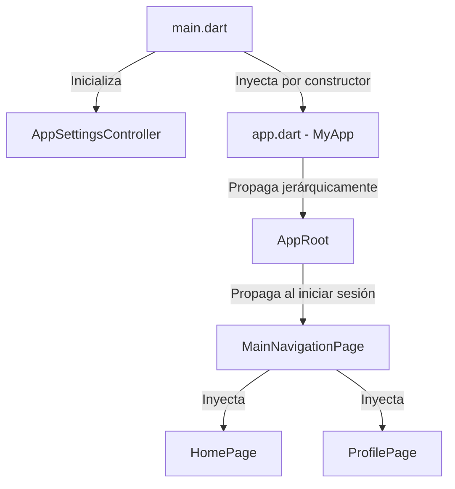

# 🏗️ Arquitectura del Proyecto - UniLost & Found Frontend

Este documento proporciona una especificación técnica rigurosa de la arquitectura de software, gestión de estados, inyección de dependencias e integraciones con la infraestructura de Firebase del frontend de la aplicación móvil **UniLost & Found (ULF)**.

---

## 📂 Arquitectura Limpia y Estructura de Directorios

La aplicación está diseñada bajo principios de **Clean Architecture** (Arquitectura Limpia) adaptados a Flutter, organizando el código en torno a módulos o funcionalidades (**features**), lo que garantiza la cohesión y reduce el acoplamiento técnico.

```text
lib/
├── core/             # Capa Core: Lógica transversal y configuraciones globales
│   ├── localization/ # Gestión de internacionalización (i18n) manual y guiada
│   ├── services/     # Servicios del sistema (Permisos, Geolocalización, Caché, Errores)
│   ├── settings/     # Controladores de estado transversal (Tema, Idioma)
│   └── theme/        # Definición del sistema de diseño visual Material 3
├── features/         # Capa de Funcionalidades (Features): Módulos de negocio independientes
│   ├── auth/         # Autenticación, registro restrictivo a dominios @uab.cat e inicio de sesión
│   ├── chats/        # Mensajería instantánea bidireccional en tiempo real
│   ├── home/         # Feed cronológico de objetos, búsquedas y geovallado en mapas
│   ├── profile/      # Perfil de usuario, actividad propia y configuración local
│   └── welcome/      # Vista de aterrizaje y punto de entrada para usuarios no autenticados
├── shared/           # Capa Compartida (Shared): Utilidades y UI Kit global
│   ├── utils/        # Utilidades estáticas de formateo y validación
│   └── widgets/      # Catálogo de componentes visuales (UI Kit reutilizable)
├── app.dart          # Widget raíz de la aplicación (MyApp y AppRoot)
└── main.dart         # Punto de entrada nativo y arranque del framework
```

---

## 🎨 Patrón de Capas en Funcionalidades

Cada módulo bajo `lib/features/` se divide conceptualmente en capas bien delimitadas:

1. **Capa de Presentación (Presentation / UI)**:
   * Compuesta por pantallas (`Pages`, `Screens`) y widgets especializados de vista.
   * Consume estados locales y globales e intercepta eventos del usuario para delegar la lógica.
   * Diseñada con total adaptabilidad responsiva bajo las directrices estéticas de **Material 3**.

2. **Capa de Lógica de Negocio (Business Logic / Controllers)**:
   * Administrada mediante controladores reactivos y de cambio como `ChangeNotifier` o flujos en tiempo real mediante `Streams`.
   * Procesa la lógica operativa (ej: comprobar si las coordenadas de un objeto están dentro del recinto universitario mediante Ray-Casting en `LocationService`).

3. **Capa de Datos (Data / Services)**:
   * Establece conexiones directas con los SDKs de Firebase (Realtime Database, Cloud Functions, Storage, Auth).
   * Mapea respuestas crudas del servidor a modelos estructurados locales (ej: `ChatModel.fromMap`).

---

## 🧠 Gestión de Estado del Frontend

La aplicación utiliza un enfoque híbrido optimizado para la gestión del estado, evitando dependencias externas complejas y garantizando la máxima velocidad y simplicidad:

### 1. Estado Transversal Persistente (`ChangeNotifier`)
El tema visual (claro/oscuro) y la internacionalización (idioma) son controlados centralizadamente por el [AppSettingsController](file:///home/carlesp/Documentos/UAB/Github/lost-found-frontend/lib/core/settings/app_settings_controller.dart). 
* Hereda de `ChangeNotifier`, permitiendo notificar cambios a los widgets suscritos (`ListenableBuilder`).
* Guarda las preferencias de los usuarios localmente en el dispositivo utilizando el paquete `shared_preferences` para asegurar persistencia entre sesiones.

### 2. Flujo en Tiempo Real de Autenticación (`StreamBuilder`)
El ciclo de vida del inicio de sesión se monitoriza en tiempo real en [app.dart](file:///home/carlesp/Documentos/UAB/Github/lost-found-frontend/lib/app.dart) a través del canal `authStateChanges()` de Firebase Auth.
* Un `StreamBuilder` reacciona de manera instantánea ante cambios en el token del dispositivo (conexión inicial, revocación, cierre de sesión).
* Realiza un control defensivo de sesión local: si la sesión supera los **14 días**, fuerza una expiración y redirige a la pantalla de Login por motivos de seguridad.

### 3. Sincronización Reactiva de Mensajes y Feeds (`Stream`)
Las pantallas de chats ([ChatsPage](file:///home/carlesp/Documentos/UAB/Github/lost-found-frontend/lib/features/chats/presentation/pages/chats_page.dart)) y del feed de objetos ([HomePage](file:///home/carlesp/Documentos/UAB/Github/lost-found-frontend/lib/features/home/presentation/pages/home_page.dart)) consumen flujos reactivos directos de Firebase Realtime Database. Esto asegura que cualquier reporte de objeto nuevo, cambio de estado (Devuelto, En Proceso) o mensaje enviado se refleje instantáneamente en el dispositivo de todos los usuarios sin llamadas HTTP manuales.

---

## 🔌 Inyección de Dependencias (DI)

La propagación de servicios y controladores se realiza de manera jerárquica y explícita por constructor, lo que facilita el mantenimiento, el testeo unitario y la depuración del flujo de datos:



* **Arranque**: `main.dart` inicializa y carga las preferencias del [AppSettingsController](file:///home/carlesp/Documentos/UAB/Github/lost-found-frontend/lib/core/settings/app_settings_controller.dart).
* **Propagación**: El controlador se inyecta en `MyApp` y se propaga en cascada hacia el widget `WelcomePage` o `MainNavigationPage` para reaccionar dinámicamente ante cambios lingüísticos o de luminosidad de pantalla.

---

## 🔐 Integración y Seguridad con Firebase

La infraestructura de Firebase opera bajo un paradigma de **Zero-Trust** (Confianza Cero). El frontend colabora estrictamente con el backend cumpliendo con las siguientes directrices de integración y seguridad:

### 1. Firebase Authentication (Acceso Institucional)
* **Verificación de Dominio**: El inicio de sesión y registro están restringidos a la comunidad de la UAB mediante expresiones regulares que imponen el uso de correos `@uab.cat`.
* **Seguridad de Token y Persistencia**: Se inicializa la persistencia en modo `Persistence.LOCAL` para mantener activa la sesión hasta un máximo de 14 días. Superado ese tiempo, el token expira automáticamente.

### 2. Firebase Realtime Database (RTDB)
* **Estructura del Feed**: Los objetos perdidos o encontrados se almacenan en nodos planos ordenados cronológicamente por marcas de tiempo en milisegundos (`createdAt`).
* **Mensajería Instantánea**: La mensajería se gestiona en el nodo `/chats/`, permitiendo sub-suscripciones para reducir el consumo de datos móviles en el cliente.
* **Denormalización de Datos**: Para optimizar las consultas y evitar lecturas costosas, los modelos de datos de chats almacenan de forma denormalizada el `postTitle`, la imagen del post (`postImageUrl`) y la información de los participantes (`displayName`, `photoUrl`).

### 3. Firebase Storage (Almacenamiento Multimedia Optimizado)
* El almacenamiento multimedia de fotos de perfil y fotos de objetos perdidos se guarda en Firebase Storage bajo reglas de acceso restringido a usuarios autenticados.
* **Optimización en el Cliente**: El frontend utiliza un gestor de caché personalizado ([CustomCacheManager](file:///home/carlesp/Documentos/UAB/Github/lost-found-frontend/lib/core/services/custom_cache_manager.dart)) que almacena localmente hasta 200 imágenes concurrentes con una caducidad automática de 7 días.

### 4. App Check (Protección de Recursos de la API)
* En `main.dart`, se inicializa **Firebase App Check** configurando los proveedores de depuración (`AndroidProvider.debug` y `AppleProvider.debug`).
* Esto garantiza que todas las peticiones que salgan desde la aplicación móvil hacia Firestore, Realtime Database o Firebase Storage sean legítimas y provengan de un binario oficial verificado, mitigando ataques de denegación de servicio (DoS) o robo de datos.
